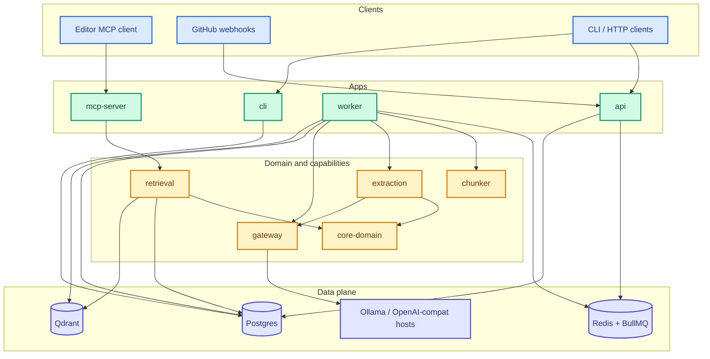

# CodeOracle

**Self-hosted MCP server that searches your codebase and remembers why it was built that way.**

Plug it into Cursor, Claude Code, or any MCP client. Index once. Ask with citations. Stay fresh via GitHub webhooks or a local reindex.

The default path is **₹0 / $0**: local Ollama embeddings. Chat models are optional and only needed when you extract architectural decisions.

| | |
|---|---|
| **License** | [MIT](./LICENSE) |
| **Status** | Stages 0–5 on `main` |
| **Runtime** | Node 20.11+ · pnpm 9.15 |
| **Stack** | Postgres 16 · Redis 7 · Qdrant · BullMQ · Ollama |
| **Contribute** | [`CONTRIBUTING.md`](./CONTRIBUTING.md) |

---

## Why CodeOracle?

Agents waste tokens re-reading the same trees and digging through old PRs for “why did we…?”. CodeOracle keeps a small, cited memory of **what the code is** and **why it looks that way**.

| Without CodeOracle | With CodeOracle |
|--------------------|-----------------|
| Paste half the repo into context | A few ranked chunks + file paths |
| Git archaeology for every design question | `find_decision` → WHY + source PR/commit URL |
| Guess which file matters | `search_codebase` / `explain_file` with citations |

It does **not** replace the model. It **narrows the haystack** so the model spends tokens answering, not hunting.

**Rules we do not bend**

- **No citation = bug** — every hit has a `filePath`; every decision has a `sourceUrl`
- **No invent** — extraction never invents tech, paths, or alternatives missing from the source
- **Config-only providers** — new LLM hosts are a `providers.yaml` change, never a new SDK
- **Domain owns policy** — ranking and filters live in `@codeoracle/core-domain`, not in HTTP glue

---

## What you get

Three MCP tools:

| Tool | What it does | Needs |
|------|----------------|-------|
| `search_codebase` | Hybrid search over indexed chunks | Embeddings |
| `explain_file` | File chunks + related decisions (no LLM rewrite) | Index |
| `find_decision` | WHY, alternatives, confidence, source URL | Extract once with a chat model; queries are retrieval only |

**Typical loop:** register a repo → worker indexes → optional decision extract → connect MCP → optional GitHub push webhooks for incremental updates.

---

## Architecture

One picture of how the pieces talk to each other:



| Color | Layer | Job |
|-------|--------|-----|
| Blue | Clients | Editors, GitHub, operators |
| Green | Apps | Transports and job runners |
| Amber | Domain | Rules + search/extract/chunk/LLM I/O |
| Indigo | Data | Postgres, Redis, Qdrant, model hosts |

**How work moves (plain language)**

1. **Index** — `worker` takes `full_index` / `incremental_reindex` from Redis, chunks files, embeds via `gateway`, writes metadata to Postgres and vectors to Qdrant.
2. **Extract (optional)** — `extraction` turns PR/commit text into Decisions (WHY + citation). Chat model used here only.
3. **Ask** — `mcp-server` calls `retrieval`, which uses `core-domain` ranking policy and returns cited answers.
4. **Stay fresh** — GitHub push → `api` verifies HMAC → queues incremental reindex.

Packages never import apps. Shared shapes live in `@codeoracle/contracts`. Details for contributors: [`CONTRIBUTING.md`](./CONTRIBUTING.md).

---

## Tech stack

| Area | Choice |
|------|--------|
| Language | TypeScript, pnpm workspaces, Turborepo |
| Validation | Zod (`contracts`, `config`) |
| API / jobs | Node HTTP API, BullMQ on Redis |
| Metadata | Postgres 16, Drizzle ORM |
| Vectors | Qdrant (`code_chunks` hybrid, `decisions` dense) |
| Chunking | tree-sitter (TS/Python) + sliding-window fallback |
| Models | OpenAI-compatible `/v1` via `gateway` (Ollama default embed) |
| MCP | `@modelcontextprotocol/sdk` — stdio or Streamable HTTP |
| GitHub | Octokit + webhook HMAC |
| Tests | Vitest, Compose smoke, e2e, golden eval |

---

## Data model

Postgres is the source of truth. Qdrant stores vectors only.

| Table | Purpose |
|-------|---------|
| `repos` | Registered repo, `index_status`, clone path, embedding model lock |
| `chunks` | Chunk text + metadata; `qdrant_point_id` links to the vector |
| `decisions` | WHY memory — `source_url` is **NOT NULL** |
| `github_sources` | Raw PR/commit bodies for extraction |
| `job_history` | Idempotency `(repo_id, job_type, dedupe_key)` + errors |
| `api_tokens` | Hashed per-repo bearer tokens (`co_…`) |

**Qdrant:** `code_chunks` (dense + sparse), `decisions` (dense).

**MCP result shapes** (citations required) — see [`packages/contracts/src/mcp.ts`](./packages/contracts/src/mcp.ts):

```ts
// search_codebase → { results: [{ chunkId, filePath, symbolName, content, score, repoId }] }
// explain_file    → { path, chunkSummaries, relatedDecisions: [{ topic, summary, sourceUrl, … }] }
// find_decision   → { results: [{ topic, summary, alternativesConsidered, sourceUrl, confidence, superseded }] }
```

Schema source: [`packages/db/src/schema/`](./packages/db/src/schema/).

**Jobs on queue `codeoracle`:** `full_index` → `chunk_file` → `embed_chunks` → (optional) `extract_decisions`; webhooks enqueue `incremental_reindex`.

---

## Quick start (≤ 10 minutes)

### 1. Install

```bash
git clone https://github.com/Jassu78/CodeOracle.git
cd CodeOracle
corepack enable
pnpm install
```

### 2. Config + data plane

```bash
cp .env.example .env
cp providers.yaml.example providers.yaml

cd infra/compose && docker compose up -d && cd ../..
pnpm db:migrate
```

Defaults match Compose (`DATABASE_URL`, `REDIS_URL`, `QDRANT_URL`).

### 3. Embeddings

```bash
ollama pull nomic-embed-text
```

Search works with embeddings alone. Enable a **chat** row in `providers.yaml` (and its API key) only when you want decision extraction.

### 4. Worker + register + index

```bash
# Terminal A
pnpm worker

# Terminal B — local mirror (no GitHub PAT)
pnpm --filter @codeoracle/cli start -- repo register --local-path /absolute/path/to/your/repo
pnpm --filter @codeoracle/cli start -- repo index <repoId>
pnpm --filter @codeoracle/cli start -- repo status <repoId>   # wait for ready
```

GitHub: set `GITHUB_PAT`, then `repo register --github OWNER/REPO`.

Guided setup: `pnpm --filter @codeoracle/cli start -- init`.

### 5. Connect MCP

```bash
pnpm --filter @codeoracle/cli start -- mcp-config <repoId>
```

Paste into Cursor MCP settings (or `.cursor/mcp.json`), then reload.

Or:

```bash
export CODEORACLE_REPO_ID=<repoId>
pnpm mcp          # stdio
pnpm mcp:http     # HTTP — bearer required
```

### 6. Extract decisions (optional)

```bash
pnpm --filter @codeoracle/cli start -- decisions extract <repoId>
pnpm decisions:review <repoId>
```

Cap spend with `EXTRACT_QUEUE_LIMIT` / `--limit N` and `EXTRACT_REPO_DAILY_TOKEN_BUDGET`.

### Try asking

| Tool | Example |
|------|---------|
| `search_codebase` | `where do we validate JWT` |
| `explain_file` | `src/auth/middleware.ts` |
| `find_decision` | `why Redis for sessions` |

Prefer **symbol names** over vague NL when searching (`verifyGitHubSignature` beats “where do we verify webhooks”).

---

## Configuration

| File | Role |
|------|------|
| `.env` ← `.env.example` | Runtime env (fail-loud validation) |
| `providers.yaml` ← `providers.yaml.example` | Chat/embed endpoints (**gitignored**) |

**Required:** `DATABASE_URL`, `REDIS_URL`, `QDRANT_URL`.

**Common optional:** `GITHUB_PAT`, `GITHUB_WEBHOOK_SECRET`, `CODEORACLE_REPO_ID`, `API_TOKEN`, `MCP_HTTP_*`, `WORKER_CONCURRENCY`, `EXTRACT_*`, provider `*_API_KEY` vars for enabled YAML rows.

**Adding a provider** = edit `providers.yaml`, set the key, `enabled: true`. Lower `priority` is tried first; failover on 429/5xx/network.

**All-local example**

```yaml
chat:
  - id: ollama-local
    kind: chat
    baseUrl: http://localhost:11434/v1
    apiKeyEnv: null
    model: qwen2.5-coder:1.5b
    priority: 1
    enabled: true
embeddings:
  - id: ollama-embed-local
    kind: embeddings
    baseUrl: http://localhost:11434/v1
    apiKeyEnv: null
    model: nomic-embed-text
    priority: 1
    enabled: true
```

---

## MCP transports

| Mode | Command | Auth |
|------|---------|------|
| stdio | `pnpm mcp` | Editor spawns the process |
| Streamable HTTP | `pnpm mcp:http` | Bearer required (`API_TOKEN`, `MCP_HTTP_BEARER_TOKEN`, or scoped `co_…`) |

HTTP listens on `127.0.0.1:3100/mcp` by default. Open-dev is not allowed on HTTP.

```json
{
  "mcpServers": {
    "codeoracle": {
      "command": "pnpm",
      "args": ["--dir", "/absolute/path/to/CodeOracle", "mcp"],
      "env": { "CODEORACLE_REPO_ID": "<repo-uuid>" }
    }
  }
}
```

---

## CLI

```bash
pnpm --filter @codeoracle/cli start -- init
pnpm --filter @codeoracle/cli start -- doctor
pnpm --filter @codeoracle/cli start -- repo register --github OWNER/REPO
pnpm --filter @codeoracle/cli start -- repo register --local-path /abs/path
pnpm --filter @codeoracle/cli start -- repo index <repoId>
pnpm --filter @codeoracle/cli start -- repo status <repoId>
pnpm --filter @codeoracle/cli start -- repo recover <repoId>
pnpm --filter @codeoracle/cli start -- decisions extract <repoId> [--clear] [--limit N]
pnpm --filter @codeoracle/cli start -- decisions review <repoId>
pnpm --filter @codeoracle/cli start -- decisions failures <repoId>
pnpm --filter @codeoracle/cli start -- mcp-config <repoId>
```

Shortcuts: `pnpm worker` · `pnpm api` · `pnpm mcp` · `pnpm mcp:http` · `pnpm db:migrate` · `pnpm decisions:review`.

---

## Webhooks

1. Set `GITHUB_WEBHOOK_SECRET` in `.env` and on GitHub.  
2. Run `pnpm api` behind HTTPS in production.  
3. Webhook URL: `https://<host>/webhooks/github` · JSON · **Push** (+ Ping).

Push → HMAC verify → `incremental_reindex`. See [`apps/api/README.md`](./apps/api/README.md).

---

## Auth

| Principal | Use |
|-----------|-----|
| Open-dev | No `API_TOKEN` and no `api_tokens` — local API only |
| `API_TOKEN` | Admin (any repo; mint tokens) |
| Per-repo `co_…` | Scoped to one `repoId` |

MCP HTTP always needs a bearer.

---

## Repo layout

```
apps/        api · worker · mcp-server · cli
packages/    contracts · config · db · core-domain · chunker
             gateway · retrieval · extraction · queue · observability
infra/       compose · docker images · ci notes
test/        sample-repo · golden eval · e2e
```

---

## Production notes

- Keep **api + worker + mcp** running; Compose for Postgres / Redis / Qdrant.
- Terminate TLS in front of API (and MCP HTTP if remote).
- Do not expose Postgres, Redis, Qdrant, or Ollama to the public internet.
- Set `API_TOKEN` and webhook secret before exposing the API.
- Images: [`infra/docker/README.md`](./infra/docker/README.md).
- Full reindex recreates Qdrant `code_chunks` — fine for single-repo dogfood; plan multi-repo carefully.

---

## Quality & CI

PRs need lint, typecheck, unit tests, Compose smoke, integration e2e, and golden eval. See [`infra/ci/README.md`](./infra/ci/README.md) and [`CONTRIBUTING.md`](./CONTRIBUTING.md).

**Honest limits:** soft NL search can prefer docs over symbols; decision list quality depends on embeddings + ranking floors; extraction tracks chat-model and PR prose quality. Empty alternatives are often honest (source named no option).

---

## License

MIT © 2026 Jaswanth Jogi — [`LICENSE`](./LICENSE).
