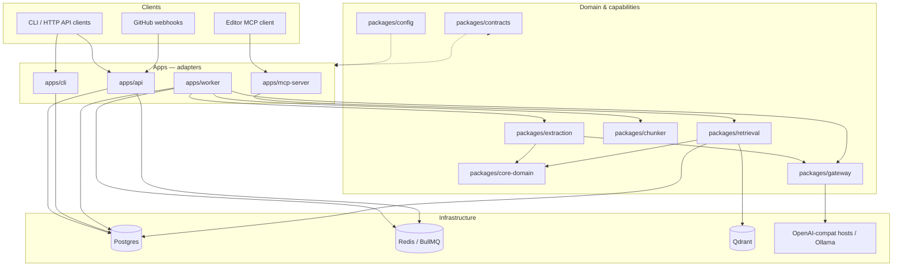
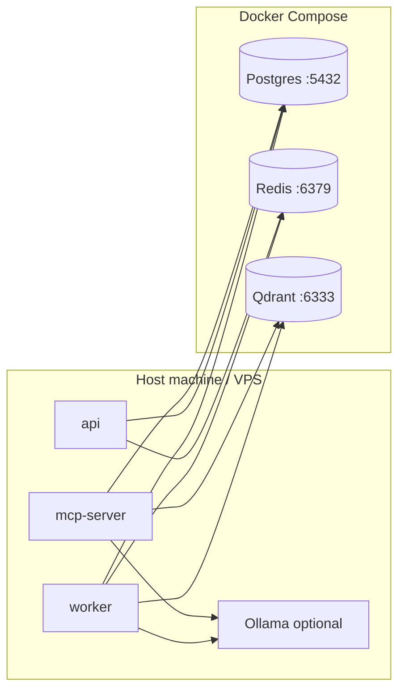
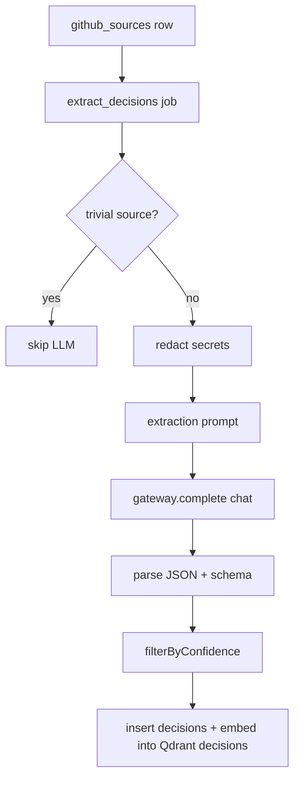
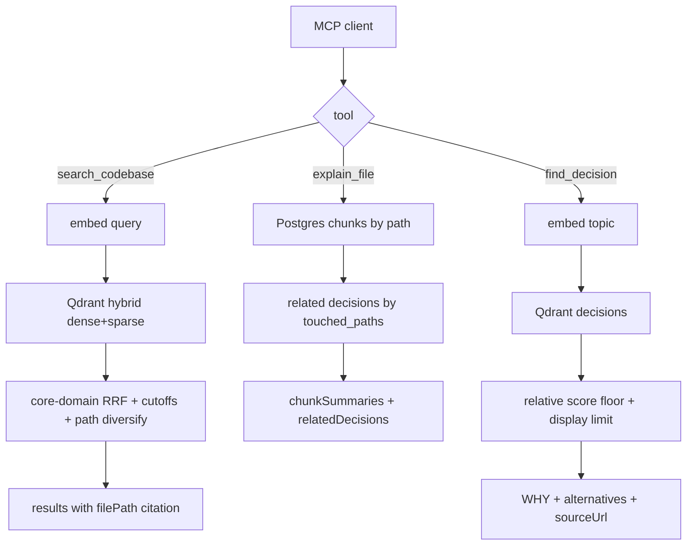
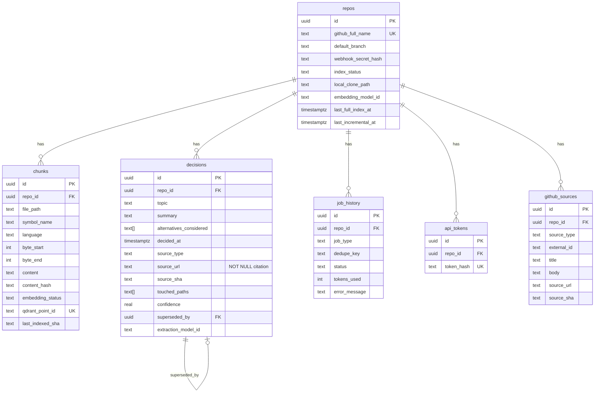

# CodeOracle

**Self-hosted MCP server that searches your code and remembers why it was built that way.**

Works with any editor MCP client (Cursor, Claude Code, and others). Stays fresh via GitHub webhooks or local reindex. **₹0 / $0 on the default path** — local Ollama embeddings; chat for decision extraction is optional and provider-config only.

| | |
|---|---|
| **License** | MIT |
| **Status** | Stages 0–5 on `main` — hybrid search, decision extraction, three citation-backed MCP tools, scoped API auth, Streamable HTTP MCP, golden eval in CI, multi-stage Docker images |
| **Runtime** | Node.js 20.11+ (&lt; 25), pnpm 9.15 |
| **Default stack** | Postgres 16 · Redis 7 · Qdrant 1.12 · BullMQ 5 · Ollama (`nomic-embed-text`) |

> Contribution rules, PR expectations, and package boundaries: **[`CONTRIBUTING.md`](./CONTRIBUTING.md)**.

---

## Table of contents

1. [Why it exists](#why-it-exists)
2. [What you get](#what-you-get)
3. [Tech stack](#tech-stack)
4. [Architecture](#architecture)
5. [How data flows](#how-data-flows)
6. [Schemas](#schemas)
7. [Requirements](#requirements)
8. [Time-to-first-query (≤ 10 minutes)](#time-to-first-query--10-minutes)
9. [Configuration](#configuration)
10. [MCP tools & transports](#mcp-tools--transports)
11. [CLI reference](#cli-reference)
12. [Stay fresh (webhooks)](#stay-fresh-github-webhooks)
13. [Auth](#auth-api--mcp-http)
14. [Repo layout](#repo-layout)
15. [Production notes](#production-notes)
16. [Quality & CI](#quality--ci)
17. [License](#license)

---

## Why it exists

Coding agents burn tokens re-reading the same trees and rediscovering old design choices from git archaeology. CodeOracle indexes a repository **once**, then answers with **small, cited slices**.

| Without CodeOracle | With CodeOracle |
|--------------------|-----------------|
| Paste or walk large trees into context | Retrieve a few ranked chunks + file paths |
| Re-litigate “why did we…?” from PRs/commits | `find_decision` → WHY + mandatory source URL |
| Guess the right file | `search_codebase` / `explain_file` with citations |

**Product principles (non-negotiable):**

- **Narrow the haystack** — do not replace the model’s reasoning; spend tokens on the answer, not scavenger hunts.
- **No citation = bug** — every search hit needs a `filePath`; every decision needs a `sourceUrl` (enforced in Zod **and** Postgres).
- **No invent** — extraction must not invent technologies, paths, or alternatives absent from the source.
- **Config-only providers** — adding Gemini/Groq/Ollama/OpenRouter is a `providers.yaml` change, never a new SDK.
- **Domain owns policy** — ranking floors, RRF cutoffs, trivial-source filters live in `@codeoracle/core-domain`, not in HTTP/MCP glue.

---

## What you get

### MCP tools

| Tool | Job | Needs |
|------|-----|--------|
| `search_codebase` | Hybrid (dense + sparse) semantic search over indexed chunks | Embeddings |
| `explain_file` | Chunks for a path + related Decisions (**deterministic** — no LLM rewrite) | Index only |
| `find_decision` | Architectural decisions (WHY), alternatives, confidence, source URL | Chat model for **extraction** (once); query path is embed + DB + ranking |

### End-to-end product loop

1. **Register** a GitHub repo or local git mirror  
2. **Worker** clones (or uses local path), chunks (tree-sitter), embeds into Qdrant, stores metadata in Postgres  
3. Optionally **extract Decisions** from PR/commit history via any OpenAI-compatible chat host  
4. **MCP** serves tools over stdio (editor) or Streamable HTTP (remote, bearer required)  
5. **Webhooks** (GitHub push) queue incremental reindex so the index stays fresh  

---

## Tech stack

| Layer | Technology | Role |
|-------|------------|------|
| Language / monorepo | **TypeScript**, **pnpm** workspaces, **Turborepo** | Typed packages; filtered builds/tests |
| Validation | **Zod 3** (`@codeoracle/contracts`, `@codeoracle/config`) | Shared I/O + env fail-loud |
| HTTP API | **Node** HTTP (`apps/api`) | Register/index, tokens, GitHub webhooks |
| Jobs | **BullMQ 5** + **Redis 7** + **ioredis** | Single queue `codeoracle` |
| Persistence | **Postgres 16** + **Drizzle ORM** + **postgres.js** | Source of truth for metadata |
| Vectors | **Qdrant** `v1.12.4` (`@qdrant/js-client-rest`) | `code_chunks` (hybrid), `decisions` (dense) |
| Chunking | **tree-sitter** (TS / Python) + sliding-window fallback | Symbol-aware chunks |
| LLM I/O | **OpenAI-compatible** `/v1` via `@codeoracle/gateway` | Embeddings + chat; failover on 429/5xx |
| Default embed | **Ollama** + `nomic-embed-text` | ₹0 local embeddings |
| Optional chat | Gemini / Groq / OpenRouter / Ollama Cloud / local Ollama | Decision extraction only |
| MCP | **`@modelcontextprotocol/sdk`** | stdio + Streamable HTTP |
| GitHub | **`@octokit/rest`**, webhook HMAC | Clone/crawl + push events |
| CLI | **commander** + **@clack/prompts** | Ops: doctor, init, repo, decisions, mcp-config |
| Tests | **Vitest**, Compose smoke, integration e2e, golden eval | CI gates on every PR |
| Containers | **Docker Compose** (data plane); optional multi-stage app images | Postgres/Redis/Qdrant (+ optional api/worker/mcp) |

---

## Architecture

### Hexagonal layout



| Package | Owns |
|---------|------|
| `core-domain` | Ranking policy, citation checks, trivial-source filter, chunk-sync plan, RRF/hybrid cutoff, path diversify, relative score floor |
| `contracts` | Zod shapes for jobs, MCP I/O, decisions, chunks, providers |
| `db` | Drizzle schema, migrations, repositories |
| `gateway` | Chat/embed ports + registry + circuit breaker |
| `retrieval` | Qdrant + search / find_decision / explain_file |
| `extraction` | Prompt, redact, parse, extract orchestration |
| `chunker` | Tree-sitter + fallback windowing |
| `queue` | BullMQ `Queue` / `Worker` helpers |
| `observability` | Structured logs + provider usage metering |
| `apps/*` | Transports and job processors only — **no reinvented domain rules** |

**Boundary rule:** `packages/*` must never import `apps/*` (enforced with `eslint-plugin-boundaries`).

### Process topology (runtime)



Typical dogfood: Compose for data services; `pnpm worker`, `pnpm api`, and `pnpm mcp` (or MCP spawned by the editor) on the host.

---

## How data flows

### 1. Full index → embed → ready

```mermaid
sequenceDiagram
  participant CLI as CLI / API
  participant Q as BullMQ (Redis)
  participant W as Worker
  participant PG as Postgres
  participant QD as Qdrant
  participant GW as Gateway (embed)

  CLI->>PG: register repo (repos row)
  CLI->>Q: enqueue full_index
  W->>Q: claim full_index
  W->>PG: index_status=indexing; clear old chunks/decisions as needed
  W->>QD: recreate code_chunks (hybrid dense+sparse)
  W->>W: clone or use local_clone_path; crawl github_sources
  loop each file
    W->>Q: enqueue chunk_file
    W->>PG: upsert chunks (embedding_status=pending)
    W->>Q: enqueue embed_chunks
    W->>GW: embed batch
    W->>QD: upsert points (point id = chunk id)
    W->>PG: embedding_status=embedded
  end
  W->>PG: index_status=ready
  opt EXTRACT_QUEUE_LIMIT / decisions extract
    W->>Q: enqueue extract_decisions per github_sources row
  end
```

### 2. Decision extraction



Extraction answers **WHY** from PR/commit text. Empty `alternativesConsidered` is valid when the source names no option. Inventing alternatives is forbidden.

### 3. Query path (MCP)



### 4. Push webhook → incremental reindex

```mermaid
sequenceDiagram
  participant GH as GitHub
  participant API as apps/api
  participant Q as BullMQ
  participant W as Worker

  GH->>API: POST /webhooks/github (push)
  API->>API: verify X-Hub-Signature-256
  API->>Q: incremental_reindex(beforeSha, afterSha)
  Note over API,Q: dedupe_key = afterSha (idempotent)
  W->>W: diff files; chunk/embed/delete as needed
  W-->>W: optional extract for tip PR
```

If a push arrives while `index_status=indexing`, the event is **deferred** in Redis and flushed when the index becomes ready.

### Job registry

| Job | Producer | Dedupe key (typical) |
|-----|----------|----------------------|
| `full_index` | CLI / API | `full-index:<run>` |
| `chunk_file` | worker | `${indexRunId}/${filePath}` |
| `embed_chunks` | worker | `${indexRunId}/embed/${filePath}` |
| `extract_decisions` | worker / CLI | `github_sources.id` |
| `incremental_reindex` | API webhook | `afterSha` |

Idempotency is enforced in Postgres: unique `(repo_id, job_type, dedupe_key)` on `job_history`.

---

## Schemas

### Postgres (source of truth)

Vectors live in **Qdrant**. Postgres stores metadata, citations, and job history.



| Table | Purpose |
|-------|---------|
| `repos` | Registered repo; `index_status`: `pending` \| `indexing` \| `ready` \| `error` |
| `chunks` | Chunk metadata; `qdrant_point_id` links to vector point |
| `decisions` | WHY memory; `source_url` **NOT NULL** |
| `github_sources` | Raw PR/commit text for extraction |
| `job_history` | Idempotency + failure visibility |
| `api_tokens` | Per-repo bearer hashes (`co_…` shown once at mint) |

Authoritative definitions: [`packages/db/src/schema/`](./packages/db/src/schema/).

### Qdrant collections

| Collection | Contents | Notes |
|------------|----------|-------|
| `code_chunks` | Chunk embeddings | Hybrid **dense + sparse** after full reindex |
| `decisions` | Decision embeddings | Dense; used by `find_decision` |

Payloads stay minimal; Postgres remains canonical for text and citations.

### MCP tool contracts (Zod)

Source: [`packages/contracts/src/mcp.ts`](./packages/contracts/src/mcp.ts).

**`search_codebase`**

```ts
// input
{ query: string; topK?: number } // default 10, max 50

// each result
{
  chunkId: string;      // uuid
  filePath: string;     // citation — required
  symbolName: string | null;
  content: string;
  score: number;
  repoId: string;
}
```

**`explain_file`**

```ts
// input
{ path: string }

// output
{
  path: string;
  chunkSummaries: string[];
  relatedDecisions: Array<{
    topic: string;
    summary: string;
    sourceUrl: string;  // citation — required
    decidedAt: string;  // ISO datetime
    superseded: boolean;
  }>;
}
```

**`find_decision`**

```ts
// input
{ topic: string; includeHistory?: boolean }

// each result
{
  topic: string;
  summary: string;
  alternativesConsidered: string[];
  sourceUrl: string;   // citation — required
  confidence: number;  // 0..1
  superseded: boolean;
}
```

Handlers validate with these schemas before returning to the client — omitting a citation fails closed.

### Decision extraction batch (LLM → parse)

```ts
{
  decisions: Array<{
    topic: string;
    summary: string;                 // WHY, not a title restatement
    alternativesConsidered: string[];
    confidence: number;
    touchedPaths: string[];
  }>;
}
```

---

## Requirements

- **Node.js** 20.11+ (&lt; 25)  
- **pnpm** 9+ (`corepack enable`)  
- **Docker** + Docker Compose (Postgres, Redis, Qdrant)  
- **git**  
- **[Ollama](https://ollama.com)** on the default path (or another embeddings endpoint in `providers.yaml`)

Optional: a free-tier chat key (Gemini / Groq / OpenRouter / Ollama Cloud) for decision extraction.

---

## Time-to-first-query (≤ 10 minutes)

### 1. Clone and install

```bash
git clone https://github.com/Jassu78/CodeOracle.git
cd CodeOracle
corepack enable
pnpm install
```

### 2. Config + data plane

```bash
cp .env.example .env
cp providers.yaml.example providers.yaml

cd infra/compose && docker compose up -d && cd ../..
pnpm db:migrate
```

`.env` defaults match Compose (`DATABASE_URL`, `REDIS_URL`, `QDRANT_URL`). Change passwords only if you change Compose.

Compose variants: [`infra/compose/README.md`](./infra/compose/README.md) (data-only, full bind-mount, or built images).

### 3. Embeddings

Default `providers.yaml` enables **Ollama** embeddings (`nomic-embed-text`):

```bash
ollama pull nomic-embed-text
```

Search and `explain_file` work with embeddings alone. For `find_decision` **after** extraction, enable one **chat** endpoint in `providers.yaml` and set its API key in `.env`.

### 4. Run worker + register a repo

```bash
# Terminal A — keep running
pnpm worker

# Terminal B — local mirror (no GitHub PAT)
pnpm --filter @codeoracle/cli start -- repo register --local-path /absolute/path/to/your/repo
# → prints a repo UUID

pnpm --filter @codeoracle/cli start -- repo index <repoId>
pnpm --filter @codeoracle/cli start -- repo status <repoId>   # wait until indexStatus=ready
```

**GitHub instead:** set `GITHUB_PAT` in `.env`, then:

```bash
pnpm --filter @codeoracle/cli start -- repo register --github OWNER/REPO --branch main
pnpm --filter @codeoracle/cli start -- repo index <repoId>
```

Guided path: `pnpm --filter @codeoracle/cli start -- init` (doctor → scaffold → register → queue index → print MCP config).

### 5. Connect MCP (stdio)

```bash
pnpm --filter @codeoracle/cli start -- mcp-config <repoId>
```

Paste the JSON into Cursor **Settings → MCP** (or `.cursor/mcp.json`). Reload MCP servers.

Or set `CODEORACLE_REPO_ID=<repoId>` in `.env` and run:

```bash
pnpm mcp          # stdio
pnpm mcp:http     # Streamable HTTP — bearer required
```

### 6. Extract decisions (optional but recommended)

```bash
pnpm --filter @codeoracle/cli start -- decisions extract <repoId>
pnpm decisions:review <repoId>
```

Use `EXTRACT_QUEUE_LIMIT` / `--limit N` for a small first sample. Soft daily cost control: `EXTRACT_REPO_DAILY_TOKEN_BUDGET`.

### 7. Example prompts

| Tool | Example |
|------|---------|
| `search_codebase` | `"where do we validate JWT"` |
| `explain_file` | path: `"src/auth/middleware.ts"` |
| `find_decision` | topic: `"why Redis for sessions"` |

Tip: for search, **symbol / API names** often beat vague natural language (`verifyGitHubSignature` vs “where do we verify webhooks”).

---

## Configuration

### Files

| File | Role |
|------|------|
| `.env` ← `.env.example` | Runtime env (validated by `@codeoracle/config`) |
| `providers.yaml` ← `providers.yaml.example` | Chat/embed endpoints (**gitignored**) |
| `infra/compose/docker-compose.yml` | Postgres / Redis / Qdrant |

### Required env

| Variable | Purpose |
|----------|---------|
| `DATABASE_URL` | Postgres |
| `REDIS_URL` | BullMQ / locks / rate limits |
| `QDRANT_URL` | Vectors |

### Important optional env

| Variable | Purpose |
|----------|---------|
| `GITHUB_PAT` | Clone + crawl private/public GitHub repos |
| `GITHUB_WEBHOOK_SECRET` | HMAC for `POST /webhooks/github` |
| `CODEORACLE_REPO_ID` | Repo UUID for MCP process |
| `CODEORACLE_MCP_TRANSPORT` | `stdio` (default) or `http` |
| `MCP_HTTP_HOST` / `MCP_HTTP_PORT` | HTTP listen (default `127.0.0.1:3100`) |
| `API_TOKEN` | Admin bearer for API / MCP HTTP |
| `MCP_HTTP_BEARER_TOKEN` | Optional dedicated MCP HTTP bearer |
| `WORKER_CONCURRENCY` | BullMQ concurrency (default 6) |
| `EMBED_BATCH_SIZE` | Embed batch size (default 32) |
| `EXTRACT_MIN_CONFIDENCE` | Drop weak extractions (default 0.5) |
| `EXTRACT_QUEUE_LIMIT` | Cap extract jobs after full index (`0` = unlimited) |
| `EXTRACT_REPO_DAILY_TOKEN_BUDGET` | Soft daily token skip (`0` = off) |
| `CODEORACLE_CLONE_DIR` | Clone root (default `./data/clones`) |
| `PROVIDERS_CONFIG_PATH` | Default `./providers.yaml` |

Provider keys (`GEMINI_API_KEY`, `GROQ_API_KEY`, `OPENROUTER_API_KEY`, `OLLAMA_API_KEY`) are only required for endpoints you **enable** in YAML.

### Provider recipes

**Adding a provider is a `providers.yaml` change — never a new SDK.**

Lower `priority` = tried first. On 429 / 5xx / network error, the gateway fails over to the next enabled endpoint.

**Recipe A — all local (₹0, offline)**

```yaml
chat:
  - id: ollama-local
    kind: chat
    baseUrl: http://localhost:11434/v1
    apiKeyEnv: null
    model: qwen2.5-coder:1.5b
    priority: 1
    enabled: true
embeddings:
  - id: ollama-embed-local
    kind: embeddings
    baseUrl: http://localhost:11434/v1
    apiKeyEnv: null
    model: nomic-embed-text
    priority: 1
    enabled: true
```

**Recipe B — local embed + free-cloud extract**

Keep Ollama embeddings. Enable `gemini-free` / `groq-free` / `openrouter-free` / `ollama-cloud` from `providers.yaml.example` and set the matching `*_API_KEY`.

---

## MCP tools & transports

| Mode | Command | Auth |
|------|---------|------|
| **stdio** (default) | `pnpm mcp` | Process isolation (editor spawns the process) |
| **Streamable HTTP** | `CODEORACLE_MCP_TRANSPORT=http pnpm mcp:http` | Bearer **required** |

HTTP path: `/mcp`. Open-dev is **not** allowed on HTTP. Details: [`apps/mcp-server/README.md`](./apps/mcp-server/README.md).

**Cursor stdio example** (from `mcp-config`):

```json
{
  "mcpServers": {
    "codeoracle": {
      "command": "pnpm",
      "args": ["--dir", "/absolute/path/to/CodeOracle", "mcp"],
      "env": {
        "CODEORACLE_REPO_ID": "<repo-uuid>"
      }
    }
  }
}
```

**Remote HTTP example:**

```json
{
  "mcpServers": {
    "codeoracle": {
      "url": "https://<your-host>/mcp",
      "headers": {
        "Authorization": "Bearer <API_TOKEN or scoped token>"
      }
    }
  }
}
```

---

## CLI reference

```bash
pnpm --filter @codeoracle/cli start -- init
pnpm --filter @codeoracle/cli start -- doctor
pnpm --filter @codeoracle/cli start -- repo register --github OWNER/REPO
pnpm --filter @codeoracle/cli start -- repo register --local-path /abs/path
pnpm --filter @codeoracle/cli start -- repo index <repoId>
pnpm --filter @codeoracle/cli start -- repo status <repoId>
pnpm --filter @codeoracle/cli start -- repo recover <repoId>
pnpm --filter @codeoracle/cli start -- decisions extract <repoId> [--clear] [--limit N]
pnpm --filter @codeoracle/cli start -- decisions review <repoId>
pnpm --filter @codeoracle/cli start -- decisions failures <repoId>
pnpm --filter @codeoracle/cli start -- mcp-config <repoId>
```

Root shortcuts: `pnpm worker`, `pnpm api`, `pnpm mcp`, `pnpm mcp:http`, `pnpm decisions:review`, `pnpm db:migrate`.

---

## Stay fresh (GitHub webhooks)

1. Set `GITHUB_WEBHOOK_SECRET` in `.env` (same value on GitHub).  
2. Run the HTTP API (`pnpm api`) behind HTTPS in production.  
3. Create a GitHub webhook:  
   - URL: `https://<your-host>/webhooks/github`  
   - Content type: `application/json`  
   - Secret: same as `GITHUB_WEBHOOK_SECRET`  
   - Events: **Push** (and Ping)  

Push → HMAC verify → queue `incremental_reindex`. Details: [`apps/api/README.md`](./apps/api/README.md).

---

## Auth (API + MCP HTTP)

| Principal | Use |
|-----------|-----|
| Open-dev | No `API_TOKEN` and no `api_tokens` rows — **local API only** |
| `API_TOKEN` | Admin — any repo; mint tokens |
| Per-repo `co_…` token | Scoped to one `repoId` (cross-repo → 403) |

MCP **HTTP** always requires a bearer. Details: [`apps/api/README.md`](./apps/api/README.md), [`apps/mcp-server/README.md`](./apps/mcp-server/README.md).

---

## Repo layout

```
apps/
  api/           HTTP + webhooks + tokens
  worker/        BullMQ processors (index / chunk / embed / extract)
  mcp-server/    MCP transports → retrieval
  cli/           doctor, init, repo, decisions, mcp-config
packages/
  contracts/     Zod schemas (jobs, MCP, decisions, …)
  config/        env + providers.yaml loader
  db/            Drizzle schema + migrations
  core-domain/   Hexagonal domain rules
  chunker/       tree-sitter chunking
  gateway/       OpenAI-compat chat/embed
  retrieval/     Qdrant + tool implementations
  extraction/    Decision extract pipeline
  queue/         BullMQ helpers
  observability/ logging + usage metering
infra/
  compose/       Postgres / Redis / Qdrant (+ optional app profiles)
  docker/        Multi-stage api/worker/mcp images
  ci/            CI notes
test/
  fixtures/      sample-repo
  golden-queries/ D5.2 eval set
  e2e/           integration tests
```

Deeper notes live in each package’s `README.md`.

---

## Production notes

- Run **API + worker + MCP** as long-lived processes (or containers); keep Compose for Postgres / Redis / Qdrant.  
- Put the API (and optional MCP HTTP) behind **HTTPS**.  
- Bind data services to **localhost** or a private network — do not expose Postgres / Redis / Qdrant / Ollama publicly.  
- Set `API_TOKEN` and `GITHUB_WEBHOOK_SECRET` before exposing the API.  
- Optional images: [`infra/docker/README.md`](./infra/docker/README.md).  
- Full reindex recreates Qdrant `code_chunks` — fine for single-repo dogfood; plan carefully for multi-repo on one Qdrant.  
- After pulling code that changes `packages/*`, rebuild package `dist/` (or use `pnpm` filters) before restarting worker/MCP if you run compiled outputs.

---

## Quality & CI

PRs must pass **lint**, **typecheck**, **unit tests**, **Compose smoke**, **integration e2e**, and **golden eval** (`pnpm test:eval`). See [`infra/ci/README.md`](./infra/ci/README.md) and [`test/golden-queries/README.md`](./test/golden-queries/README.md).

How to contribute: [`CONTRIBUTING.md`](./CONTRIBUTING.md).

**Honest limits today:**

- Soft natural-language search can prefer **docs** over implementation symbols — prefer precise queries (symbols / API names).  
- `find_decision` list quality depends on embedding geometry + relative score floor; top-1 is usually stronger than a long tail.  
- Extraction quality tracks the chat model and the quality of PR/commit prose.  
- Empty alternatives are often **honest** (source named no option); do not treat empty% as the sole quality metric.

---

## License

MIT — see [`LICENSE`](./LICENSE). Copyright (c) 2026 Jaswanth Jogi.

Launch checklist: MIT ✓ · `.env.example` ✓ · Compose data stack ✓ · host `pnpm` apps ✓ · multi-stage images (`infra/docker`).
