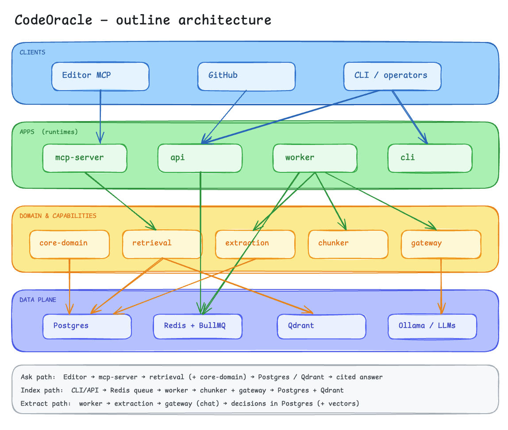

# CodeOracle

**Self-hosted MCP server that searches your codebase and remembers why it was built that way.**

[](./LICENSE)
[](https://github.com/Jassu78/CodeOracle/actions/workflows/ci.yml)
[](https://nodejs.org)
[](https://pnpm.io)
[](https://typescriptlang.org/)
[](https://modelcontextprotocol.io/)

Plug it into Cursor, Claude Code, or any MCP client. Index once. Ask with citations. Stay fresh via GitHub webhooks or a local reindex.

**Status:** actively developed. Hybrid **code search** and **file explain** are the strongest paths today. **Decision memory** works end-to-end, but extract quality tracks whatever chat model you configure — we treat that as a known limit and keep improving ranking, prompts, and evals. We do **not** claim “perfect answers out of the box.”

**Default path is private-by-design:** run the stack on your machine or your VPC; use **local Ollama** (or any local OpenAI-compatible server) for embeddings and, if you want, for decision extract — so source and PR text need not leave your network. Cloud providers are optional, config-only, and never required for search.

Interactive overview: [`docs/demo/index.html`](./docs/demo/index.html) · live site (GitHub Pages): https://jassu78.github.io/CodeOracle/

Contributing: [`CONTRIBUTING.md`](./CONTRIBUTING.md)

---

## Privacy & offline

CodeOracle is built for teams that want **agent memory without shipping the monorepo to a vendor RAG cloud by default**.

| Mode | What leaves your machine |
|------|---------------------------|
| **All-local** (Compose + Ollama embed ± local chat) | Nothing required for search; extract stays local if chat is local |
| **Local embed + optional cloud chat** | Only texts you send to extract (PR/commit bodies), after secret scrubbing — not a full repo upload product |
| **Your own VPC** | Same binary; point `providers.yaml` at internal endpoints |

That is the wedge beside “ask the IDE on demand”: a **durable index you operate**, with citations, that can run air-gapped or offline for the search path. Infra and model capacity are still your cost — local does not mean free of hardware.

---

## What this is (and isn’t)

Coding agents are strong at reading **today’s** files in-session. They are weak at durable team memory:

- why Postgres won over the alternative two years ago  
- which PR recorded an auth edge case  
- what you already rejected — and why  

That context lives in PR bodies, review threads, and people’s heads. Session to session, the agent forgets.

CodeOracle is a **small, cited memory layer** your agent can call over MCP — not another “chat with the repo” UI, and not a replacement for Cursor’s own indexing.

| Is | Is not |
|---|---|
| Hybrid search + decision archive with mandatory citations | A Cursor competitor for general coding |
| Self-hosted index your team owns | “Upload the monorepo to our cloud” by default |
| Tools any MCP client can call | Locked to one IDE |
| Fresh via webhooks / reindex | Magic that invents rationale missing from sources |

**Product test:** if you remove a fancy UI and still have *queryable architectural decisions + cited code search for any coding agent*, you built CodeOracle.

---

## Why not “just ask Cursor”?

Cursor (and similar tools) already do a **quick lookup** of the current tree — and they’re excellent at that. Use them.

CodeOracle is for the layer beside that:

1. **Cited retrieval you own** — ranked chunks with file paths, same contract every time, on hardware you control.  
2. **Decision memory** — structured WHY mined from git/PR history, with a mandatory source URL (not vibes).  
3. **Team freshness** — one shared index updated by webhooks, so every engineer’s agent sees the same archive.

If the only job is “find this function in the open repo,” the editor is enough. If the job is “remember why we chose this, with proof, across sessions and teammates,” that’s the gap this project targets — and we’re still sharpening how well extraction fills that gap depending on the chat model you run.

---

## What you get

| Tool | What it does | Needs |
|------|----------------|-------|
| `search_codebase` | Hybrid search over indexed chunks | Embeddings |
| `explain_file` | File chunks + related decisions (no LLM rewrite) | Index |
| `find_decision` | WHY, alternatives, confidence, source URL | Extract once with a chat model; queries are retrieval only |

**Typical loop:** register a repo → worker indexes → optional decision extract → connect MCP → optional GitHub push webhooks.

**Rules we do not bend**

- **No citation = bug** — every hit has a `filePath`; every decision has a `sourceUrl`  
- **No invent** — extraction never invents tech, paths, or alternatives missing from the source  
- **Config-only providers** — new LLM hosts are a `providers.yaml` change, never a new SDK  
- **Domain owns policy** — ranking and filters live in `@codeoracle/core-domain`, not in HTTP glue  

---

## Honest limits (read this)

- **Search / explain** improve with a good index and embeddings. Prefer symbol-ish queries when you can (`authorizeForRepo` beats vague prose). Soft NL can still prefer docs over code — we’re tightening that with evals.  
- **Decision extract** quality follows your **chat** model and how much rationale exists in PR/commit text. Small or weak local models often produce thin or noisy decisions; stronger models (local or cloud) usually do better. Empty `alternatives` is often honest — the source never named an option.  
- CodeOracle **narrows the haystack**; it does not replace the coding model in your editor.  
- Prefer **all-local** providers when code must not leave your environment; use cloud chat only when you accept that extract payloads go to that API.

---

## Architecture

<p align="center">
  
</p>

**Layers:** blue = who calls in · green = runtimes · amber = product logic · indigo = storage and models.

| Path | Flow |
|------|------|
| **Ask** | Editor → `mcp-server` → `retrieval` (+ `core-domain`) → Postgres / Qdrant → cited answer |
| **Index** | CLI/API → Redis → `worker` → `chunker` + `gateway` → Postgres + Qdrant |
| **Extract** | `worker` → `extraction` → `gateway` (chat) → decisions in Postgres (+ vectors) |
| **Fresh** | GitHub push → `api` (HMAC) → `incremental_reindex` |

Packages never import apps. Shared shapes live in `@codeoracle/contracts`.

---

## Tech stack

| Area | Choice |
|------|--------|
| Language | TypeScript, pnpm workspaces, Turborepo |
| Validation | Zod (`contracts`, `config`) |
| API / jobs | Node HTTP API, BullMQ on Redis |
| Metadata | Postgres 16, Drizzle ORM |
| Vectors | Qdrant (`code_chunks` hybrid, `decisions` dense) |
| Chunking | tree-sitter (TS/Python) + sliding-window fallback |
| Models | OpenAI-compatible `/v1` via `gateway` (Ollama default embed) |
| MCP | `@modelcontextprotocol/sdk` — stdio or Streamable HTTP |
| GitHub | Octokit + webhook HMAC |
| Tests | Vitest, Compose smoke, e2e, golden eval |

---

## Data model

Postgres is the source of truth. Qdrant stores vectors only.

| Table | Purpose |
|-------|---------|
| `repos` | Registered repo, `index_status`, clone path, embedding model lock |
| `chunks` | Chunk text + metadata; `qdrant_point_id` links to the vector |
| `decisions` | WHY memory — `source_url` is **NOT NULL** |
| `github_sources` | Raw PR/commit bodies for extraction |
| `job_history` | Idempotency `(repo_id, job_type, dedupe_key)` + errors |
| `api_tokens` | Hashed per-repo bearer tokens (`co_…`) |

**Qdrant:** `code_chunks` (dense + sparse), `decisions` (dense).

**MCP result shapes** (citations required) — [`packages/contracts/src/mcp.ts`](./packages/contracts/src/mcp.ts):

```ts
// search_codebase → { results: [{ chunkId, filePath, symbolName, content, score, repoId }] }
// explain_file    → { path, chunkSummaries, relatedDecisions: [{ topic, summary, sourceUrl, … }] }
// find_decision   → { results: [{ topic, summary, alternativesConsidered, sourceUrl, confidence, superseded }] }
```

Schema source: [`packages/db/src/schema/`](./packages/db/src/schema/).

**Jobs on queue `codeoracle`:** `full_index` → `chunk_file` → `embed_chunks` → (optional) `extract_decisions`; webhooks enqueue `incremental_reindex`.

---

## Quick start (≤ 10 minutes)

### 1. Install

```bash
git clone git@github.com:Jassu78/CodeOracle.git
cd CodeOracle
corepack enable
pnpm install
```

### 2. Config + data plane

```bash
cp .env.example .env
cp providers.yaml.example providers.yaml

cd infra/compose && docker compose up -d && cd ../..
pnpm db:migrate
```

Defaults match Compose (`DATABASE_URL`, `REDIS_URL`, `QDRANT_URL`).

### 3. Embeddings

```bash
ollama pull nomic-embed-text
```

Search works with embeddings alone. Enable a **chat** row in `providers.yaml` (and its API key, if any) only when you want decision extraction. Prefer a capable chat model for extract — tiny models are fine for experiments, weaker for production-quality decisions.

### 4. Worker + register + index

```bash
# Terminal A
pnpm worker

# Terminal B — local mirror (no GitHub PAT)
pnpm --filter @codeoracle/cli start -- repo register --local-path /absolute/path/to/your/repo
pnpm --filter @codeoracle/cli start -- repo index <repoId>
pnpm --filter @codeoracle/cli start -- repo status <repoId>   # wait for ready
```

GitHub: set `GITHUB_PAT`, then `repo register --github OWNER/REPO`.

Guided setup: `pnpm --filter @codeoracle/cli start -- init`.

### 5. Connect MCP

```bash
pnpm --filter @codeoracle/cli start -- mcp-config <repoId>
```

Paste into Cursor MCP settings (or `.cursor/mcp.json`), then reload.

Or:

```bash
export CODEORACLE_REPO_ID=<repoId>
pnpm mcp          # stdio
pnpm mcp:http     # HTTP — bearer required
```

### 6. Extract decisions (optional)

```bash
pnpm --filter @codeoracle/cli start -- decisions extract <repoId>
pnpm decisions:review <repoId>
```

Cap spend with `EXTRACT_QUEUE_LIMIT` / `--limit N` and `EXTRACT_REPO_DAILY_TOKEN_BUDGET`.

### Try asking

| Tool | Example |
|------|---------|
| `search_codebase` | `where do we validate JWT` |
| `explain_file` | `apps/api/src/lib/auth.ts` |
| `find_decision` | `why hybrid ranking` |

Prefer **symbol names** over vague NL when searching (`verifyGitHubSignature` beats “where do we verify webhooks”).

---

## Configuration

| File | Role |
|------|------|
| `.env` ← `.env.example` | Runtime env (fail-loud validation) |
| `providers.yaml` ← `providers.yaml.example` | Chat/embed endpoints (**gitignored**) |

**Required:** `DATABASE_URL`, `REDIS_URL`, `QDRANT_URL`.

**Common optional:** `GITHUB_PAT`, `GITHUB_WEBHOOK_SECRET`, `CODEORACLE_REPO_ID`, `API_TOKEN`, `MCP_HTTP_*`, `WORKER_CONCURRENCY`, `EXTRACT_*`, provider `*_API_KEY` vars for enabled YAML rows.

**Adding a provider** = edit `providers.yaml`, set the key, `enabled: true`. Lower `priority` is tried first; failover on 429/5xx/network.

**All-local example**

```yaml
chat:
  - id: ollama-local
    kind: chat
    baseUrl: http://localhost:11434/v1
    apiKeyEnv: null
    model: qwen2.5-coder:7b   # use the strongest local chat model you can run for extract
    priority: 1
    enabled: true
embeddings:
  - id: ollama-embed-local
    kind: embeddings
    baseUrl: http://localhost:11434/v1
    apiKeyEnv: null
    model: nomic-embed-text
    priority: 1
    enabled: true
```

---

## MCP transports

| Mode | Command | Auth |
|------|---------|------|
| stdio | `pnpm mcp` | Editor spawns the process |
| Streamable HTTP | `pnpm mcp:http` | Bearer required (`API_TOKEN`, `MCP_HTTP_BEARER_TOKEN`, or scoped `co_…`) |

HTTP listens on `127.0.0.1:3100/mcp` by default. Open-dev is not allowed on HTTP.

```json
{
  "mcpServers": {
    "codeoracle": {
      "command": "pnpm",
      "args": ["--dir", "/absolute/path/to/CodeOracle", "mcp"],
      "env": { "CODEORACLE_REPO_ID": "<repo-uuid>" }
    }
  }
}
```

---

## CLI

```bash
pnpm --filter @codeoracle/cli start -- init
pnpm --filter @codeoracle/cli start -- doctor
pnpm --filter @codeoracle/cli start -- repo register --github OWNER/REPO
pnpm --filter @codeoracle/cli start -- repo register --local-path /abs/path
pnpm --filter @codeoracle/cli start -- repo index <repoId>
pnpm --filter @codeoracle/cli start -- repo status <repoId>
pnpm --filter @codeoracle/cli start -- repo recover <repoId>
pnpm --filter @codeoracle/cli start -- decisions extract <repoId> [--clear] [--limit N]
pnpm --filter @codeoracle/cli start -- decisions review <repoId>
pnpm --filter @codeoracle/cli start -- decisions failures <repoId>
pnpm --filter @codeoracle/cli start -- mcp-config <repoId>
```

Shortcuts: `pnpm worker` · `pnpm api` · `pnpm mcp` · `pnpm mcp:http` · `pnpm db:migrate` · `pnpm decisions:review`.

---

## Webhooks

1. Set `GITHUB_WEBHOOK_SECRET` in `.env` and on GitHub.  
2. Run `pnpm api` behind HTTPS in production.  
3. Webhook URL: `https://<host>/webhooks/github` · JSON · **Push** (+ Ping).

Push → HMAC verify → `incremental_reindex`. See [`apps/api/README.md`](./apps/api/README.md).

---

## Auth

| Principal | Use |
|-----------|-----|
| Open-dev | No `API_TOKEN` and no `api_tokens` — local API only |
| `API_TOKEN` | Admin (any repo; mint tokens) |
| Per-repo `co_…` | Scoped to one `repoId` |

MCP HTTP always needs a bearer.

---

## Repo layout

```
apps/        api · worker · mcp-server · cli
packages/    contracts · config · db · core-domain · chunker
             gateway · retrieval · extraction · queue · observability
infra/       compose · docker images · ops helpers · ci notes
test/        sample-repo · golden eval · e2e
docs/        intro · specs · demo page
```

---

## Production notes

- Keep **api + worker + mcp** running; Compose for Postgres / Redis / Qdrant.
- **One worker only** per Redis queue — duplicates keep stale code in memory after rebuilds. See [`infra/dogfood/README.md`](./infra/dogfood/README.md).
- Terminate TLS in front of API (and MCP HTTP if remote).
- Do not expose Postgres, Redis, Qdrant, or Ollama to the public internet.
- Set `API_TOKEN` and webhook secret before exposing the API.
- Images: [`infra/docker/README.md`](./infra/docker/README.md).
- Full reindex recreates Qdrant `code_chunks` — fine for a single-repo deployment; plan multi-repo carefully.

---

## Quality & CI

PRs need lint, typecheck, unit tests, Compose smoke, integration e2e, and golden eval. See [`infra/ci/README.md`](./infra/ci/README.md) and [`CONTRIBUTING.md`](./CONTRIBUTING.md).

**Live index replay (any ready repo):** suite JSON + `codeoracle replay <repoId> --suite test/replay/suites/….json` — see [`test/replay/README.md`](./test/replay/README.md). Complements fixture `pnpm test:eval`; does not replace it. CI runs golden eval + replay unit/schema tests; live product-index replay is an ops gate (needs a ready index + real embeddings).

---

## License

MIT © 2026 Jaswanth Jogi — [`LICENSE`](./LICENSE).
